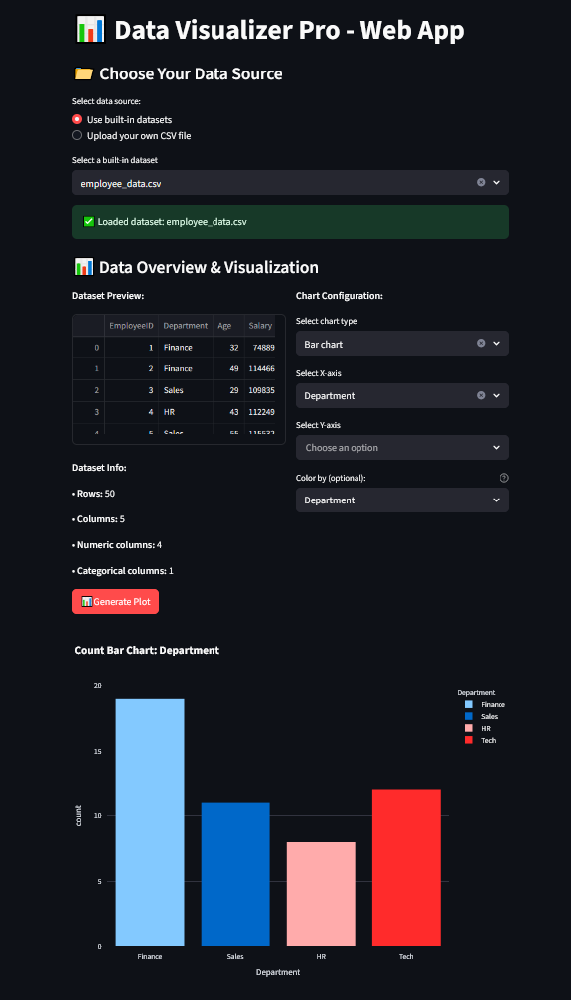

# 📊 Data Visualizer Pro - Web Application


An interactive web application for visualizing CSV data with beautiful charts and graphs.



## 🌟 Features

- **Multiple Data Sources**:
  - Use built-in sample datasets
  - Upload your own CSV files
- **Interactive Visualizations**:
  - Line charts
  - Bar charts
  - Scatter plots
  - Distribution plots
  - Count plots
- **Customization Options**:
  - Choose X/Y axes
  - Color coding by categories
  - Adjustable bin sizes for histograms
- **User-Friendly Interface**:
  - Clean, modern design
  - Responsive layout
  - Help sections for guidance

## 🚀 Quick Start

### Prerequisites
- Python 3.7+
- pip package manager

### Installation
1. Clone the repository:
   ```bash
   git clone https://github.com/sankaran-s2001/Data-Visualizer-Web-App.git
   cd Data-Visualizer-Web-App
   ```

# Install dependencies
```bash
pip install -r requirements.txt
```

# Lauch the app
```bash
streamlit run app.py
```

# File Structure
.
├── Data/ # Sample datasets
│ ├── cyclone_dataset.csv
│ ├── employee_data.csv
│ ├── sales_data.csv
│ └── student_scores.csv
├── app.py # Main application
├── requirements.txt # Dependencies
└── README.md # Documentation


## ✉️ Contact
**Sankaran S**  
[](https://github.com/sankaran-s2001)  
[](https://www.linkedin.com/in/sankaran-s21/)  
[](mailto:sankaran121101@gmail.com)

---

⭐ If you find this project useful, please star it!
